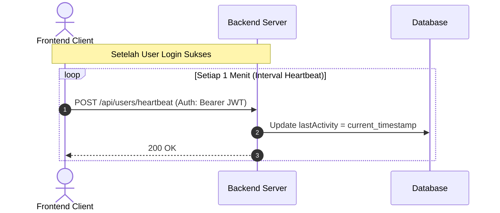

# Panduan Integrasi Frontend: Tracking User Presence (Heartbeat)

Dokumen ini menjelaskan cara integrasi frontend dengan API Heartbeat Backend untuk memantau status online/offline user secara real-time.

---

## 1. Detail Endpoint

### Send Heartbeat
Digunakan oleh frontend untuk memperbarui timestamp aktivitas terakhir user yang sedang login, menandakan bahwa user tersebut masih aktif (online).

* **URL**: `/api/users/heartbeat`
* **Method**: `POST`
* **Headers**:
  * `Authorization`: `Bearer <JWT_TOKEN>`
* **Request Body**: *None* (Kosong)
* **Response**:
  * `200 OK` jika berhasil memperbarui status aktivitas.
  * `401 Unauthorized` jika token tidak valid atau kedaluwarsa.

---

## 2. Alur Kerja & Mekanisme Heartbeat

Karena backend menggunakan sistem stateless JWT, backend melacak status online berdasarkan pencatatan waktu aktivitas terakhir (`lastActivity`).



### Rekomendasi Interval
* **Interval Pengiriman**: Lakukan pemanggilan `POST /api/users/heartbeat` setiap **1 menit** sekali menggunakan `setInterval` (atau mekanisme background task serupa di aplikasi client).
* **Penentuan Status Online/Offline**:
  * Di sisi backend, seorang user dianggap **Online** jika `lastActivity` berada dalam rentang **5 menit terakhir**.
  * Jika dalam waktu 5 menit backend tidak menerima heartbeat baru dari user tersebut, status user bersangkutan akan otomatis terhitung sebagai **Offline** (`isOnline` bernilai `false`).

---

## 3. Struktur Data User Response

Setiap kali frontend memanggil endpoint yang mengembalikan data user (seperti `GET /api/auth/me` atau `GET /api/users`), backend akan menyertakan informasi status aktivitas terakhir:

```json
{
  "id": 5,
  "fullName": "Budi Gudang",
  "username": "gudang_budi",
  "active": true,
  "mustChangePassword": false,
  "lastLogin": "2026-06-16T00:15:30",
  "phoneNumber": "08123456789",
  "lastActivity": "2026-06-16T00:20:15",
  "isOnline": true,
  "role": {
    "id": 2,
    "name": "GUDANG",
    "description": "Warehouse"
  }
}
```

### Keterangan Field Baru:
* `lastActivity`: Waktu UTC/Lokal terakhir kali user mengirimkan heartbeat (atau melakukan aktivitas login).
* `isOnline`: Boolean (`true`/`false`) yang dihitung secara dinamis oleh backend (`lastActivity > current_time - 5 minutes`).

---

## 4. Contoh Implementasi di Frontend (React / Vue / Vanilla JS)

Berikut adalah contoh implementasi pengiriman heartbeat menggunakan JavaScript (Axios):

```javascript
import axios from 'axios';

// Interval pengiriman: 1 menit (60.000 ms)
const HEARTBEAT_INTERVAL = 60 * 1000; 
let heartbeatTimer = null;

/**
 * Fungsi untuk memulai pengiriman heartbeat secara periodik
 */
export function startHeartbeatTracking() {
  if (heartbeatTimer) return;

  // Lakukan pengiriman pertama segera setelah login
  sendHeartbeat();

  // Atur interval pengiriman periodik
  heartbeatTimer = setInterval(sendHeartbeat, HEARTBEAT_INTERVAL);
  console.log("Presence tracking started.");
}

/**
 * Fungsi untuk menghentikan pengiriman heartbeat (misal saat logout)
 */
export function stopHeartbeatTracking() {
  if (heartbeatTimer) {
    clearInterval(heartbeatTimer);
    heartbeatTimer = null;
    console.log("Presence tracking stopped.");
  }
}

/**
 * Pemanggilan API Heartbeat
 */
async function sendHeartbeat() {
  const token = localStorage.getItem('jwt_token'); // Dapatkan token tersimpan
  if (!token) {
    stopHeartbeatTracking();
    return;
  }

  try {
    await axios.post('/api/users/heartbeat', {}, {
      headers: {
        Authorization: `Bearer ${token}`
      }
    });
  } catch (error) {
    console.error("Gagal mengirimkan heartbeat:", error.response?.data || error.message);
    if (error.response?.status === 401) {
      // Jika token tidak valid / kedaluwarsa, hentikan tracking dan logout user
      stopHeartbeatTracking();
    }
  }
}
```

---

## 5. Hubungi Admin Gudang via WhatsApp

Ketika backend mendeteksi stok menipis atau tidak mencukupi, frontend dapat mencari admin gudang yang sedang **online** (`isOnline: true` dengan role `GUDANG`).

Apabila ditemukan staf gudang yang online, frontend dapat menampilkan tombol WhatsApp langsung ke nomor telepon mereka.

**Format Link WhatsApp API**:
`https://wa.me/<phoneNumber>?text=<urlencoded_message>`

*Contoh Link*:
`https://wa.me/628123456789?text=Halo%20Admin%20Gudang%2C%20mohon%20cek%20stok%20bahan%20baku%20Matcha%20yang%20menipis.`
