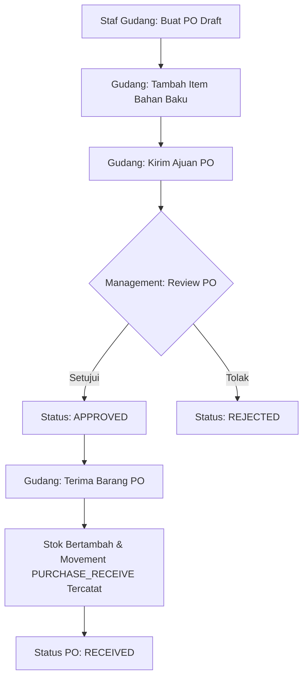
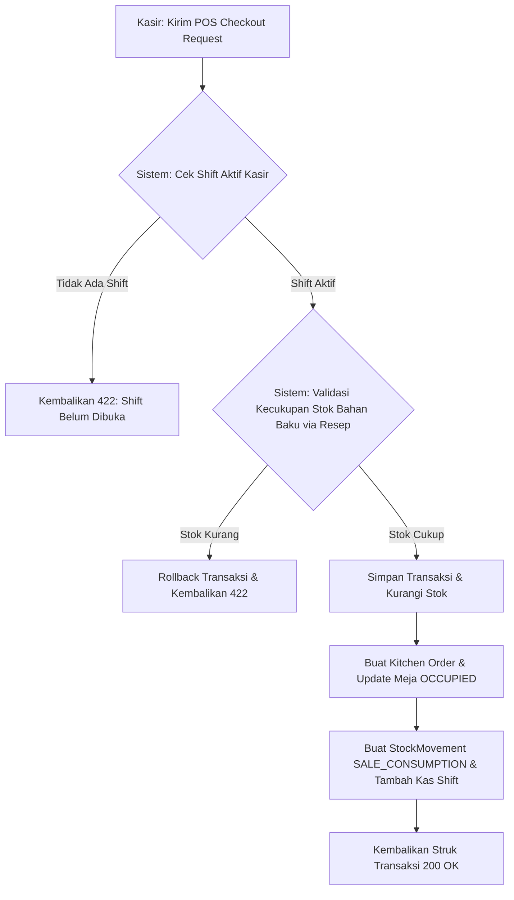

# BrewLedger Backend

Backend REST API untuk BrewLedger, aplikasi Point of Sale (POS), manajemen inventori bahan baku, pembelian, dapur, meja, dan pelaporan kedai kopi. Aplikasi dibangun dengan Java 25, Spring Boot 3.5, PostgreSQL, Spring Security, dan JWT.

## Daftar Isi

- [Fitur](#fitur)
- [Teknologi](#teknologi)
- [Arsitektur](#arsitektur)
- [Prasyarat](#prasyarat)
- [Konfigurasi](#konfigurasi)
- [Menjalankan Aplikasi](#menjalankan-aplikasi)
- [Autentikasi dan Otorisasi](#autentikasi-dan-otorisasi)
- [Alur Bisnis Utama](#alur-bisnis-utama)
- [Model Data](#model-data)
- [Struktur Proyek](#struktur-proyek)
- [Testing](#testing)
- [Build dan Production](#build-dan-production)
- [Dokumentasi API](#dokumentasi-api)

---

## Fitur

### 1. Autentikasi & Otorisasi Terenkripsi
- Login berbasis JSON Web Token (JWT).
- Role-based Access Control (RBAC) dengan 3 role bawaan: `MANAGEMENT`, `GUDANG`, dan `KASIR`.
- Password dienkripsi menggunakan hashing BCrypt.
- Penegakan penggantian password wajib (`mustChangePassword`) untuk akun baru.

### 2. Shift Management Terpusat (Oleh Management)
- Kasir (`KASIR`) dan Staf Gudang (`GUDANG`) tidak dapat membuka/menutup shift secara mandiri.
- Shift dikontrol langsung oleh role `MANAGEMENT` melalui target user ID.
- Kasir wajib memiliki shift aktif agar dapat memproses transaksi checkout POS.
- Kalkulasi selisih uang kas penutupan shift (`cashDifference`) secara otomatis berdasarkan kas awal dan riwayat total penjualan.

### 3. POS Transaksi yang Atomik (Atomic Checkout)
- Pemrosesan POS checkout berjalan dalam satu transaksi database tunggal (Atomic).
- Validasi stok bahan baku otomatis berdasarkan resep produk (Recipe). Jika stok salah satu bahan baku tidak mencukupi, seluruh transaksi dan pengurangan stok di-rollback secara otomatis.
- Sinkronisasi otomatis ke status meja restoran (`RestaurantTable`), penambahan kas shift aktif, pembuatan pesanan dapur (`KitchenOrder`), dan audit trail pergerakan stok.
- Proteksi request ganda menggunakan validasi header `Idempotency-Key`.

### 4. Persetujuan Terpusat (Centralized Approvals)
- Seluruh aksi sensitif membutuhkan persetujuan terpusat (Centralized Approval Workflow):
  - Void transaksi POS (`VOID_TRANSACTION`).
  - Penyesuaian stok bahan baku manual (`STOCK_ADJUSTMENT`).
  - Pengajuan bahan baku baru ke dalam katalog (`NEW_INGREDIENT`).
- Validasi ketat untuk menghindari aksi pemrosesan mandiri (Self-Approval Guard).
- Validasi peran target persetujuan (Gudang menyetujui ajuan Management, dan sebaliknya).
- Proteksi re-processing (status yang sudah disetujui/ditolak tidak dapat diproses ulang, mengembalikan HTTP 409 Conflict).

### 5. Manajemen Inventori & Audit Trail Stok
- Riwayat pergerakan stok (`StockMovement`) terekam secara otomatis untuk setiap perubahan dengan tipe pergerakan: `SALE_CONSUMPTION`, `PURCHASE_RECEIVE`, `STOCK_REQUEST_COMPLETED`, `MANUAL_ADJUSTMENT`, `VOID_REVERSAL`.
- Kolom kuantitas stok bertanda positif (`+`) untuk penambahan dan negatif (`-`) untuk pengurangan.
- Pencatatan otomatis kolom `createdBy` berisi username staf yang memicu perubahan stok.

### 6. Laporan Keuangan Dinamis & Ekspor CSV
- Laporan penjualan, pembelian, dan inventori yang mendukung filter rentang tanggal (`from` / `to`) dan parameter pengelompokan (`groupBy`: `DAY`, `WEEK`, `MONTH`).
- Ekspor laporan berformat CSV dengan penegakan eksplisit HTTP header encoding `text/csv; charset=utf-8`.

### 7. Manajemen Meja & Dapur (Tables & Kitchen Orders)
- Pembaruan status meja secara otomatis (`AVAILABLE` / `OCCUPIED`).
- Pembuatan Kitchen Order otomatis pada saat transaksi dine-in berhasil diproses, lengkap dengan item detail dan catatan instruksi khusus (notes).
- Pelacakan status pesanan dapur (`WAITING`, `COOKING`, `DONE`).

### 8. User Heartbeat Presence & Monitor Keaktifan
- Endpoint heartbeat (`POST /api/users/heartbeat`) untuk memperbarui status aktivitas user secara real-time.
- Pemantauan daftar user yang sedang online berdasarkan riwayat aktivitas 5 menit terakhir.

### 9. Observability
- Endpoint monitoring kesehatan server publik `/api/health` yang memeriksa status database (UP/DOWN) serta menyertakan stempel waktu (timestamp).

---

## Teknologi

| Komponen | Teknologi |
|---|---|
| Bahasa | Java 21+ |
| Framework | Spring Boot 3.5.x |
| Database | PostgreSQL (Supabase / Local) |
| ORM | Spring Data JPA / Hibernate |
| Keamanan | Spring Security, JWT, BCrypt |
| Validasi | Jakarta Bean Validation |
| Build Tool | Maven Wrapper |
| Pengujian | JUnit 5, Spring Boot Test, H2 (Compatibility Mode PostgreSQL) |
| Library Lain | Lombok, springboot3-dotenv |

---

## Arsitektur

Aplikasi menggunakan pola arsitektur berlapis (Layered Architecture):

```text
Client (SwiftUI macOS / iOS)
        │
        ▼
Controller (REST API Endpoints & Request Validation)
        │
        ▼
Service (Logika Bisnis & Transaction Boundary)
        │
        ▼
Repository (Data Access Layer via Spring Data JPA)
        │
        ▼
Database (PostgreSQL)
```

---

## Prasyarat

- Java Development Kit (JDK) 21 atau lebih baru.
- PostgreSQL Database untuk profile `prod`.
- Maven (opsional, sudah disediakan Maven Wrapper `./mvnw`).

Periksa versi Java Anda:
```bash
java -version
```

---

## Konfigurasi

Secara default aplikasi berjalan dengan profile `dev` dan memakai H2 lokal di folder `data/`, sehingga server bisa start tanpa PostgreSQL. Untuk production, aktifkan profile `prod`; aplikasi akan membaca parameter konfigurasi melalui file `.env` di root direktori proyek. Salin contoh di bawah ini dan sesuaikan dengan environment Anda:

```properties
DB_URL=jdbc:postgresql://localhost:5432/brewledger
DB_USERNAME=postgres
DB_PASSWORD=your_password

ADMIN_FULLNAME=Satriya Dwi Mahardhika
ADMIN_USERNAME=satriyadm9311
ADMIN_PASSWORD=admin9311

JWT_SECRET=your-super-long-secure-jwt-secret-key-at-least-32-bytes
```

> [!WARNING]
> Jangan pernah meng-commit file `.env` atau kredensial produksi ke Git. File `.env` sudah masuk ke dalam `.gitignore`.

---

## Menjalankan Aplikasi

### Mode Pengembangan (Development)
Jalankan perintah berikut pada terminal di root direktori proyek:
```bash
./mvnw spring-boot:run
```

Aplikasi akan berjalan di port `8081` secara default:
```text
http://localhost:8081
```

Jika port `8081` sedang dipakai, jalankan dengan port lain:
```bash
SERVER_PORT=18081 ./mvnw spring-boot:run
```

Profile `dev` otomatis memakai database lokal H2. Untuk memaksa koneksi PostgreSQL lokal/Supabase saat development, jalankan dengan profile `prod` dan pastikan `.env` berisi `DB_URL`, `DB_USERNAME`, `DB_PASSWORD`, `ADMIN_*`, dan `JWT_SECRET` yang benar:
```bash
SPRING_PROFILES_ACTIVE=prod ./mvnw spring-boot:run
```

### Verifikasi Login
Anda dapat menguji apakah server berjalan dan kredensial admin default berfungsi menggunakan `curl`:
```bash
curl -X POST http://localhost:8081/api/auth/login \
  -H "Content-Type: application/json" \
  -d '{
    "username": "satriyadm9311",
    "password": "admin9311"
  }'
```

---

## Autentikasi dan Otorisasi

Seluruh endpoint API dilindungi oleh otentikasi JWT (kecuali `/api/auth/login` dan `/api/health`). Kirimkan token yang Anda dapatkan saat login pada header HTTP `Authorization`:
```http
Authorization: Bearer <JWT_TOKEN>
```

### Pemetaan Role Bawaan
- **`MANAGEMENT`**: Mengakses laporan penjualan, riwayat audit log, shift management, dashboard, menu approval terpusat, dan purchase order approval.
- **`GUDANG`**: Mengakses workspace inventori bahan baku, pergerakan stok, pengajuan update stok, pembuatan purchase order, serta penerimaan barang PO.
- **`KASIR`**: Mengakses POS menu catalog, pembuatan transaksi checkout, dan detail struk belanja.

---

## Alur Bisnis Utama

### 1. Alur Kerja Pengadaan Barang (Purchase Order)


### 2. Alur POS Transaksi (Atomic POS Checkout)


---

## Model Data

Tabel-tabel database yang digunakan dalam aplikasi ini meliputi:

1. **`users`** & **`roles`**: Mengelola kredensial staf dan hak akses (RBAC).
2. **`products`** & **`product_categories`**: Mengelola produk menu kafe beserta kategorinya.
3. **`ingredients`** & **`suppliers`**: Mengelola bahan baku dasar dan pemasoknya.
4. **`product_recipes`**: Pemetaan kebutuhan bahan baku (ingredient) untuk setiap produk.
5. **`cashier_shifts`**: Mengelola siklus shift kasir (pembukaan, penutupan, saldo kas awal, saldo kas akhir, selisih kas).
6. **`transactions`** & **`transaction_items`**: Menyimpan struk transaksi POS.
7. **`kitchen_orders`** & **`kitchen_order_items`**: Pesanan yang diteruskan ke dapur untuk diproses.
8. **`restaurant_tables`**: Nomor meja dan status keterisian meja.
9. **`purchase_orders`** & **`purchase_order_items`**: Mengelola pengadaan bahan baku ke supplier.
10. **`approval_requests`**: Log persetujuan terpusat untuk void transaksi, adjustment stok, dan ingredient baru.
11. **`stock_movements`**: Log riwayat pergerakan stok bahan baku (audit trail).
12. **`activity_logs`**: Log aktivitas audit trail tindakan sensitif user di sistem.

---

## Struktur Proyek

```text
src/
├── main/
│   ├── java/com/brewledger/brewledger/backend/
│   │   ├── config/          # Konfigurasi aplikasi (CORS, Security, Thread pool)
│   │   ├── controller/      # REST API Controllers (HTTP Endpoints)
│   │   ├── dto/             # Data Transfer Objects (Request/Response Contract)
│   │   ├── entity/          # JPA Entities (Database Tables mapping)
│   │   ├── enums/           # Java Enums (Status, Tipe Pembayaran)
│   │   ├── exception/       # Exception Handling & Custom Business Exceptions
│   │   ├── repository/      # Spring Data JPA Repositories
│   │   ├── security/        # JWT Authentication Filter & User Details Service
│   │   └── service/         # Logika Bisnis Utama (Core Services)
│   └── resources/
│       ├── application.properties
│       ├── application-dev.properties
│       └── application-prod.properties
└── test/
    └── java/com/brewledger/brewledger/backend/
        ├── ManagementWorkflowIntegrationTests.java # Integrasi Workflow Manajemen
        └── NewFeaturesIntegrationTests.java        # Integrasi Fitur POS, PO, Shifts, dll.
```

---

## Testing

Backend BrewLedger dilengkapi dengan pengujian integrasi penuh (`Integration Tests`) menggunakan database H2 in-memory. Untuk menjalankan pengujian, gunakan perintah berikut:

```bash
./mvnw test
```

Semua pengujian (35 test cases) mencakup:
- Validasi siklus PO, re-calculation HPP, dan harga pokok penjualan.
- Manajemen shift kasir dan pembatasan hak akses.
- Integrasi transaksi POS atomik dan pengurangan stok.
- Persetujuan terpusat (Centralized Approvals) dan pencegahan self-approval.
- Log audit pergerakan stok, ekspor laporan, dan kesehatan database.

---

## Build dan Production

### Kompilasi (Build Package JAR)
Untuk mengompilasi proyek menjadi file executable JAR:
```bash
./mvnw clean package
```
File JAR hasil kompilasi akan berada di folder `target/brewledger.backend-0.0.1-SNAPSHOT.jar`.

### Menjalankan File JAR
Jalankan aplikasi produksi menggunakan profile `prod`:
```bash
SPRING_PROFILES_ACTIVE=prod java -jar target/brewledger.backend-0.0.1-SNAPSHOT.jar
```

---

## Dokumentasi API

Seluruh endpoint, parameter request, format response JSON, status code, dan contoh integrasi klien terdokumentasi dengan sangat lengkap dan jelas di dalam file:
👉 **[API_DOCUMENTATION.md](API_DOCUMENTATION.md)**
