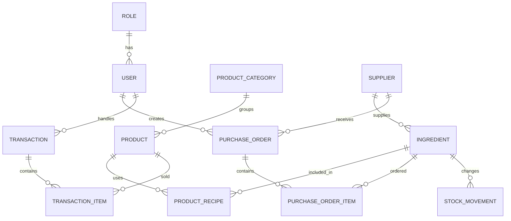

# BrewLedger Backend

Backend REST API untuk BrewLedger, aplikasi Point of Sale (POS), inventori bahan baku, pembelian, dan pelaporan kedai. Aplikasi dibangun dengan Spring Boot, PostgreSQL, Spring Security, dan JWT.

## Daftar Isi

- [Fitur](#fitur)
- [Teknologi](#teknologi)
- [Arsitektur](#arsitektur)
- [Prasyarat](#prasyarat)
- [Konfigurasi](#konfigurasi)
- [Menjalankan Aplikasi](#menjalankan-aplikasi)
- [Autentikasi dan Otorisasi](#autentikasi-dan-otorisasi)
- [Alur Bisnis](#alur-bisnis)
- [Model Data](#model-data)
- [Struktur Proyek](#struktur-proyek)
- [Testing](#testing)
- [Build dan Production](#build-dan-production)
- [Dokumentasi API](#dokumentasi-api)
- [Catatan Implementasi](#catatan-implementasi)

## Fitur

- Login menggunakan JWT.
- Role awal: `ADMIN`, `MANAGEMENT`, `GUDANG`, dan `KASIR`.
- Manajemen user oleh admin.
- Master data kategori, produk, supplier, dan ingredient.
- Resep produk yang menghubungkan produk dengan kebutuhan ingredient.
- Purchase order dan penerimaan barang.
- POS dengan pengurangan stok otomatis berdasarkan resep.
- Riwayat pergerakan stok untuk pembelian dan penjualan.
- Dashboard ringkasan operasional.
- Statistik hari ini, perbandingan kemarin, dan tren tujuh hari.
- Agregasi kategori, user aktif, stok kritis, dan pending purchase order.
- Workspace POS khusus kasir dengan katalog berbasis ketersediaan recipe.
- Workspace gudang untuk inventori, komposisi, movement, dan request approval.
- Workflow persetujuan PO antara gudang dan management.
- Laporan penjualan, pembelian, dan nilai inventori.
- Global validation dan error response.

## Teknologi

| Komponen | Teknologi |
|---|---|
| Bahasa | Java 21 |
| Framework | Spring Boot 3.5.14 |
| API | Spring Web MVC |
| Database | PostgreSQL |
| ORM | Spring Data JPA / Hibernate |
| Security | Spring Security, JWT, BCrypt |
| Validation | Jakarta Bean Validation |
| Build | Maven Wrapper |
| Testing | JUnit 5, Spring Boot Test, H2 |
| Utility | Lombok, springboot3-dotenv |

## Arsitektur

Proyek menggunakan layered architecture:

```text
Client (macOS/iOS/Web)
        |
        v
Controller -> Service -> Repository -> PostgreSQL
        |          |
        |          +-> business rules dan transaction boundary
        +-> request validation dan HTTP response
```

- `controller`: endpoint HTTP.
- `service`: logika bisnis dan transaksi database.
- `repository`: query dan akses data dengan Spring Data JPA.
- `entity`: pemetaan tabel database.
- `dto`: kontrak request dan response API.
- `security`: parsing JWT dan pembuatan authentication context.
- `exception`: standardisasi error aplikasi.

## Prasyarat

- Java Development Kit 21.
- PostgreSQL yang dapat diakses aplikasi.
- macOS/Linux: Maven tidak wajib karena tersedia `./mvnw`.
- Windows: gunakan `mvnw.cmd`.

Periksa Java:

```bash
java -version
```

## Konfigurasi

Aplikasi membaca environment variable melalui `springboot3-dotenv`. Buat file `.env` di root proyek:

```properties
DB_URL=jdbc:postgresql://localhost:5432/brewledger
DB_USERNAME=postgres
DB_PASSWORD=change-me

ADMIN_FULLNAME=BrewLedger Administrator
ADMIN_USERNAME=admin
ADMIN_PASSWORD=change-this-admin-password

JWT_SECRET=replace-with-a-long-random-secret-at-least-32-bytes
```

Jangan commit `.env` atau secret production ke Git.

### Environment Variable

| Variable | Wajib | Keterangan |
|---|---:|---|
| `DB_URL` | Ya | JDBC URL PostgreSQL |
| `DB_USERNAME` | Ya | Username database |
| `DB_PASSWORD` | Ya | Password database |
| `ADMIN_FULLNAME` | Ya | Nama admin bootstrap |
| `ADMIN_USERNAME` | Ya | Username admin bootstrap |
| `ADMIN_PASSWORD` | Ya | Password awal admin bootstrap |
| `JWT_SECRET` | Ya | Secret HMAC JWT; gunakan nilai acak yang panjang |

Konfigurasi default berada di `src/main/resources/application.properties`:

- Port: `8081`.
- Hibernate: `ddl-auto=update`.
- JWT expiration: `86400000` ms atau 24 jam.
- SQL logging: aktif.

Profile `prod` mengubah Hibernate menjadi `validate` dan menonaktifkan SQL logging. Karena belum ada Flyway/Liquibase, schema production harus sudah tersedia sebelum aplikasi dijalankan dengan profile ini.

## Menjalankan Aplikasi

### Development

```bash
./mvnw spring-boot:run
```

Windows:

```powershell
.\mvnw.cmd spring-boot:run
```

Server tersedia di:

```text
http://localhost:8081
```

### Verifikasi Login

```bash
curl -X POST http://localhost:8081/api/auth/login \
  -H "Content-Type: application/json" \
  -d '{
    "username": "admin",
    "password": "change-this-admin-password"
  }'
```

Gunakan token dari response:

```bash
curl http://localhost:8081/api/dashboard \
  -H "Authorization: Bearer <JWT_TOKEN>"
```

## Autentikasi dan Otorisasi

`POST /api/auth/login` adalah satu-satunya endpoint publik. Endpoint lain membutuhkan header:

```http
Authorization: Bearer <token>
```

Saat startup, aplikasi membuat role berikut jika belum ada:

| Role | Tujuan |
|---|---|
| `ADMIN` | Administrator sistem |
| `MANAGEMENT` | Pengelolaan bisnis dan laporan |
| `GUDANG` | Pengelolaan stok dan bahan baku |
| `KASIR` | Transaksi penjualan |

Admin awal dibuat dari environment variable jika username tersebut belum ada. Password disimpan menggunakan BCrypt.

Endpoint utama dibedakan berdasarkan role:

- `ADMIN`: seluruh endpoint role-specific dan manajemen user.
- `MANAGEMENT`: dashboard, approval PO, dan laporan.
- `KASIR`: katalog serta checkout melalui `/api/pos/**`.
- `GUDANG`: workspace inventori dan operasional PO.

## Alur Bisnis

### Bootstrap

1. Aplikasi membuat role bawaan.
2. Aplikasi membuat admin awal jika `ADMIN_USERNAME` belum terdaftar.
3. Admin awal memiliki `mustChangePassword=true`.

Belum tersedia endpoint khusus untuk mengganti password sendiri atau mengubah flag `mustChangePassword`.

### Purchase Order

1. Gudang membuat PO dengan status `DRAFT`.
2. Gudang menambahkan satu atau lebih item ingredient.
3. Gudang mengajukan PO sehingga status menjadi `PENDING_APPROVAL`.
4. Management menyetujui menjadi `APPROVED` atau menolak menjadi `REJECTED`.
5. Gudang menerima PO yang sudah disetujui.
6. Stok ingredient bertambah dan movement `PURCHASE` dibuat.
7. Status PO menjadi `RECEIVED`.

Item dapat ditambahkan saat PO berstatus `DRAFT` atau `REJECTED`. PO hanya dapat diterima setelah berstatus `APPROVED`, dan penerimaan PO kosong ditolak.

### Transaksi POS

1. Client mengirim jenis transaksi, metode pembayaran, dan item produk.
2. Harga produk aktif saat request dipakai sebagai `unitPrice`.
3. Subtotal dihitung dari seluruh item.
4. Pajak dihitung tetap sebesar 11%.
5. Status pembayaran otomatis menjadi `PAID`.
6. Setiap resep produk dihitung berdasarkan jumlah produk.
7. Stok ingredient dikurangi dan stock movement `SALE` dibuat.

Pembuatan transaksi berjalan dalam satu database transaction. Jika stok salah satu ingredient tidak cukup, seluruh perubahan transaksi dan stok di-rollback.

Produk tanpa recipe tetap dapat dijual dan tidak mengurangi ingredient.

### Low Stock

Ingredient masuk daftar low stock jika:

```text
currentStock <= minimumStock
```

## Model Data



Semua entity mewarisi `id`, `createdAt`, dan `updatedAt` dari `BaseEntity`.

| Entity | Fungsi utama |
|---|---|
| `User`, `Role` | Identitas, status user, dan hak akses |
| `ProductCategory`, `Product` | Master produk yang dijual |
| `Supplier`, `Ingredient` | Master pemasok dan bahan baku |
| `ProductRecipe` | Jumlah ingredient untuk satu unit produk |
| `PurchaseOrder`, `PurchaseOrderItem` | Dokumen pembelian dan rinciannya |
| `Transaction`, `TransactionItem` | Header dan rincian penjualan |
| `StockMovement` | Audit perubahan stok ingredient |

Nilai enum:

- `TransactionType`: `DINE_IN`, `TAKE_AWAY`.
- `PaymentMethod`: `CASH`, `QRIS`, `CARD`.
- `PaymentStatus`: `PENDING`, `PAID`, `CANCELLED`.
- `PurchaseOrderStatus`: `DRAFT`, `PENDING_APPROVAL`, `APPROVED`, `RECEIVED`, `REJECTED`, `CANCELLED`.
- Stock movement yang saat ini dibuat service: `PURCHASE`, `SALE`.

## Struktur Proyek

```text
src/
├── main/
│   ├── java/com/brewledger/brewledger/backend/
│   │   ├── config/
│   │   ├── controller/
│   │   ├── dto/
│   │   ├── entity/
│   │   ├── enums/
│   │   ├── exception/
│   │   ├── repository/
│   │   ├── security/
│   │   └── service/
│   └── resources/
│       ├── application.properties
│       └── application-prod.properties
└── test/
    ├── java/
    └── resources/application.properties
```

## Testing

Jalankan:

```bash
./mvnw test
```

Test menggunakan H2 in-memory dalam compatibility mode PostgreSQL. Saat ini tersedia smoke test Spring context, dashboard, katalog POS, workspace gudang, dan workflow PO sampai stok diterima. Test otorisasi HTTP dan edge case transaksi masih perlu diperluas.

## Build dan Production

Build JAR:

```bash
./mvnw clean package
```

Jalankan JAR:

```bash
java -jar target/brewledger.backend-0.0.1-SNAPSHOT.jar
```

Jalankan profile production:

```bash
java -Dspring.profiles.active=prod \
  -jar \
  target/brewledger.backend-0.0.1-SNAPSHOT.jar
```

Atau:

```bash
SPRING_PROFILES_ACTIVE=prod java -jar target/brewledger.backend-0.0.1-SNAPSHOT.jar
```

Checklist production:

- Gunakan secret JWT acak dan kuat.
- Ubah password admin bootstrap.
- Batasi CORS dari wildcard ke origin frontend yang diizinkan.
- Siapkan schema database sebelum memakai `ddl-auto=validate`.
- Gunakan TLS/HTTPS di reverse proxy atau platform deployment.
- Simpan credential melalui secret manager platform.
- Tambahkan database migration dan backup policy.

## Dokumentasi API

Kontrak endpoint, request, response, status code, dan contoh integrasi tersedia di [API_DOCUMENTATION.md](API_DOCUMENTATION.md).

Ringkasan endpoint:

| Modul | Base path |
|---|---|
| Authentication | `/api/auth` |
| Dashboard | `/api/dashboard` |
| Users | `/api/users` |
| Categories | `/api/categories` |
| Products | `/api/products` |
| Suppliers | `/api/suppliers` |
| Ingredients | `/api/ingredients` |
| Recipes | `/api/product-recipes` |
| Purchase orders | `/api/purchase-orders` |
| Transactions | `/api/transactions` |
| Stock movements | `/api/stock-movements` |
| Reports | `/api/reports` |

## Catatan Implementasi

- Belum ada Swagger/OpenAPI endpoint.
- Belum ada pagination pada endpoint list.
- Belum ada update/delete untuk master kategori, produk, supplier, ingredient, dan recipe.
- Belum ada endpoint daftar role; `roleId` user harus diambil langsung dari data bootstrap/database.
- Belum ada endpoint cancel PO atau transaksi.
- Nomor transaksi dan PO dibuat dari `System.currentTimeMillis()`.
- Nilai uang masih menggunakan `Double`, bukan `BigDecimal`.
- Transaksi baru mencatat user login sebagai kasir dan PO baru mencatat user pembuat.
- Response transaksi belum menampilkan transaction type, payment method, payment status, notes, atau waktu transaksi.
- CORS saat ini menerima seluruh origin pattern dan perlu dibatasi untuk production.
